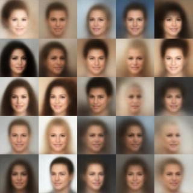

Repo for [ameroyer.github.io](ameroyer.github.io)

This webpage contains various code snippets and other small projects I have worked one. 
See the following index by thematic categories for more details.

**Main keywords:** Python, Tensorflow, Machine Learning, Computer Vision, Data Visualization

### Machine Learning

| Link      | Preview       | Description   |
| :------------: | :-----------: | :----------- |
| [VAES](http://ameroyer.github.io/python,/tensorflow,/generative,/vae/2017/10/01/vae.html) |   | Vanilla variational auto-encoders as introduced   in *Auto-Encoding Variational Bayes* |
| [GLO](http://ameroyer.github.io/python,/tensorflow,/generative,/vae/2017/10/12/glo.html) |   | Generative latent optimization model as introduced   in *Optimizing the latent space of Generative Networks* |

### Data Visualization

| Link      | Preview       | Description   |
| :------------: | :-----------: | :----------- |
| [Wonderwheel](http://ameroyer.github.io/visualization,/data,/html,/css,/python/2017/12/02/wonderwheel.html) |   | Interactive CSS3/HTML5 image visualization based on   hue histograms at multiple image resolutions |
